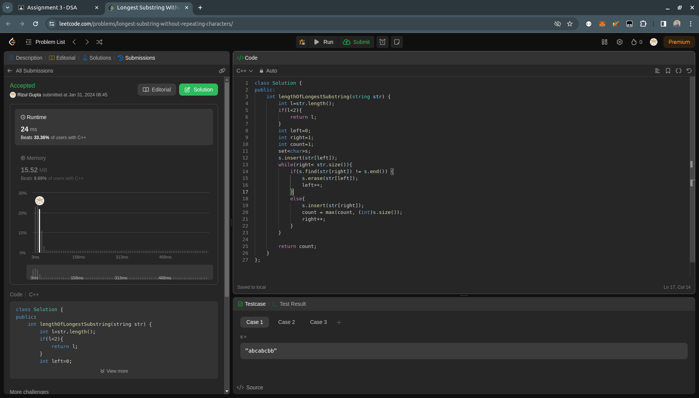

## Question- 1 (Longest Substring w/o Repeating Characters)

- **Submission Link:** [LeetCode Submission](https://leetcode.com/problems/longest-substring-without-repeating-characters/submissions/1161548895)
- **Status:** Passed all test cases
- **Time Complexity:** O(l) where l is the length of the string.
- **Space Complexity:** O(l) where l is the length of the string.
- **Explanation:** It utilizes a sliding window approach, using pointers to track the substring's boundaries and a set to maintain unique characters within the window. The window slides through the string, adjusting pointers and updating the count of unique characters encountered. Finally, it returns the maximum count as the length of the longest substring without repeating characters.
  
