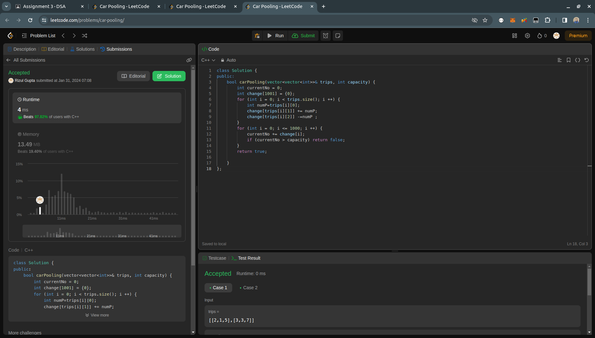

## Question- 2 (Car Pooling)

- **Submission Link:** [LeetCode Submission](https://leetcode.com/problems/car-pooling/submissions/1161560445)
- **Status:** Passed all test cases
- **Time Complexity:** O(n) where n is the number of stops
- **Space Complexity:** O(1) as independent
- **Explanation:** It iterates through each trip, updating the number of passengers in the car at each position along the road. After iterating through the entire road, it checks if the number of passengers exceeds the capacity at any point. If so, it returns false; otherwise, it returns true.
  
