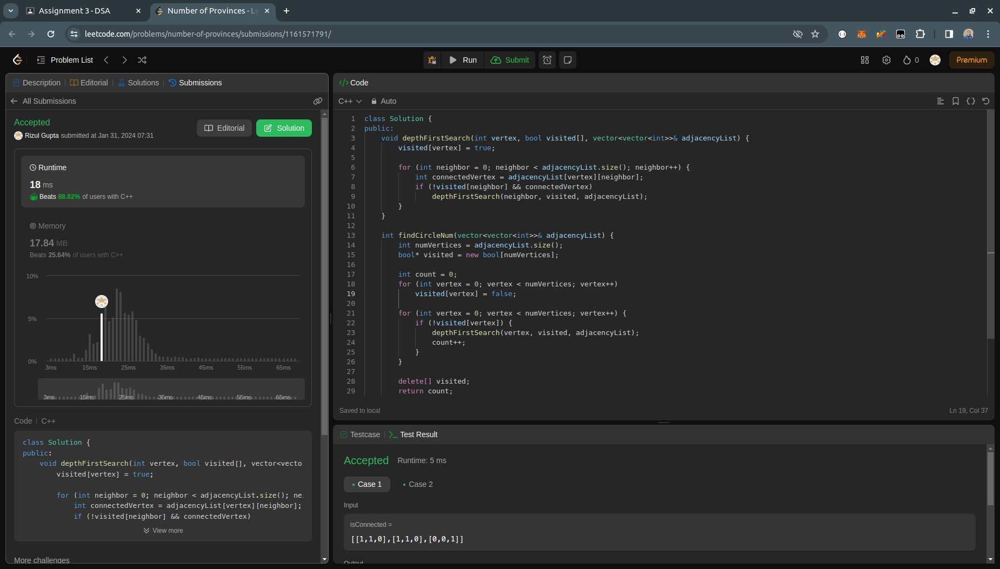

## Question- 3 (Number of Provinces)

- **Submission Link:** [LeetCode Submission](https://leetcode.com/problems/number-of-provinces/submissions/1161571791)
- **Status:** Passed all test cases
- **Time Complexity:** O(n+r) where n is number of cities and r is the number of roads and r<=n^2 so worst case time-complexity is O(n^2)
- **Space Complexity:** O(n) where n is the number of cities
- **Explanation:** Considering each city as vertex in graph and road connecting them as the edge of graph. So each province is equivalent to a connected component in graph. The depthFirstSearch method performs a depth-first search traversal on a graph represented by an adjacency list, marking visited vertices. The findCircleNum method initializes an array to track visited vertices, iterates through each vertex, and if unvisited, calls depthFirstSearch to traverse the connected component and increments the count of connected components. Finally, it returns the count of connected components in the graph. 
  
