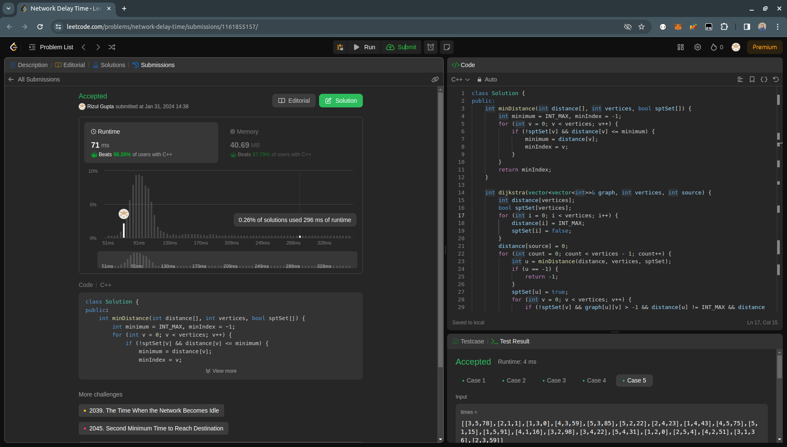

## Question- 4 (Network Delay Time)

- **Submission Link:** [LeetCode Submission](https://leetcode.com/problems/network-delay-time/submissions/1161855157)
- **Status:** Passed all test cases
- **Time Complexity:** 
- **Space Complexity:**
- **Explanation:** Considering each Finding the maximum time taken to reach any node from a given source node in a weighted directed graph, representing the network delay time. It utilizes Dijkstra's algorithm to compute the shortest paths from the source node to all other nodes efficiently, handling edge cases where nodes cannot be reached by returning -1.
  
