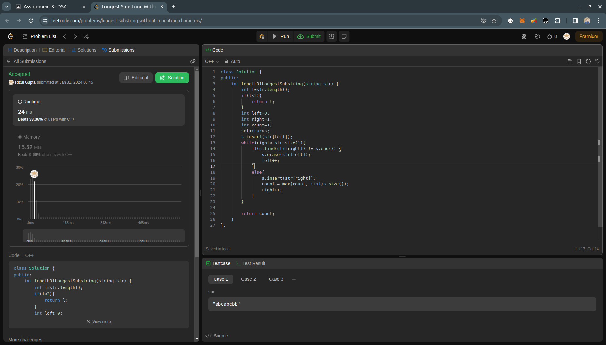

# DSA Assignment-3

## Question- 1 (Longest Substring w/o Repeating Characters)

- **Submission Link:** [LeetCode Submission](https://leetcode.com/problems/longest-substring-without-repeating-characters/submissions/1161548895)
- **Status:** Passed all test cases
- **Time Complexity:** O(l) where l is the length of the string.
- **Space Complexity:** O(l) where l is the length of the string.
- **Explanation:** It utilizes a sliding window approach, using pointers to track the substring's boundaries and a set to maintain unique characters within the window. The window slides through the string, adjusting pointers and updating the count of unique characters encountered. Finally, it returns the maximum count as the length of the longest substring without repeating characters.
  

## Question- 2 (Car Pooling)

- **Submission Link:** [LeetCode Submission](https://leetcode.com/problems/car-pooling/submissions/1161560445)
- **Status:** Passed all test cases
- **Time Complexity:** O(n) where n is the number of stops
- **Space Complexity:** O(1) as independent
- **Explanation:** It iterates through each trip, updating the number of passengers in the car at each position along the road. After iterating through the entire road, it checks if the number of passengers exceeds the capacity at any point. If so, it returns false; otherwise, it returns true.
  

## Question- 3 (Number of Provinces)

- **Submission Link:** [LeetCode Submission](https://leetcode.com/problems/number-of-provinces/submissions/1161571791)
- **Status:** Passed all test cases
- **Time Complexity:** O(n+r) where n is number of cities and r is the number of roads and r<=n^2 so worst case time-complexity is O(n^2)
- **Space Complexity:** O(n) where n is the number of cities
- **Explanation:** Considering each city as vertex in graph and road connecting them as the edge of graph. So each province is equivalent to a connected component in graph. The depthFirstSearch method performs a depth-first search traversal on a graph represented by an adjacency list, marking visited vertices. The findCircleNum method initializes an array to track visited vertices, iterates through each vertex, and if unvisited, calls depthFirstSearch to traverse the connected component and increments the count of connected components. Finally, it returns the count of connected components in the graph.
  

## Question- 4 (Network Delay Time)

- **Submission Link:** [LeetCode Submission](https://leetcode.com/problems/network-delay-time/submissions/1161855157)
- **Status:** Passed all test cases
- **Time Complexity:** O(n+r) where n is number of cities and r is the number of roads and r<=n^2 so worst case time-complexity is O(n^2)
- **Space Complexity:** O(n) where n is the number of cities
- **Explanation:** Considering each node as vertex of a graph. To find the maximum time taken to reach any node from a given source node in a weighted directed graph, representing the network delay time. It utilizes Dijkstra's algorithm to compute the shortest paths from the source node to all other nodes efficiently, handling edge cases where nodes cannot be reached by returning -1. Then return the maximum of all these shortest times to get network delay time.
  

## Question- 5 (Implement Trie)

- **Submission Link:** [LeetCode Submission](https://leetcode.com/problems/implement-trie-prefix-tree/submissions/1161872868)
- **Status:** Passed all test cases
- _insertHelper Function_ : Recursively inserts a word into the Trie. It traverses the Trie based on characters of the word, creating new TrieNode objects as needed.
  - _Time Complexity_: O(L), where L is the length of the word being inserted.
  - _Space Complexity_: O(L), due to the recursive calls and creation of new TrieNode objects.
- _insert Function_: Invokes the insertHelper to insert a word into the Trie.
- _searchHelper Function_: Recursively searches for a word in the Trie. It traverses the Trie based on characters of the word, returning true if the word is found and false otherwise.
  - _Time Complexity_: O(L), where L is the length of the word being searched.
  - _Space Complexity_: O(L), due to the recursive calls.
- _search Function_: Invokes the searchHelper to search for a word in the Trie.
- _startsWithHelper Function_: Recursively checks if a prefix exists in the Trie. It traverses the Trie based on characters of the prefix, returning true if the prefix is found and false otherwise.
  - _Time Complexity_: O(P), where P is the length of the prefix being checked.
  - _Space Complexity_: O(P), due to the recursive calls.
- _startsWith Function_: Invokes the startsWithHelper to check if a prefix exists in the Trie.

